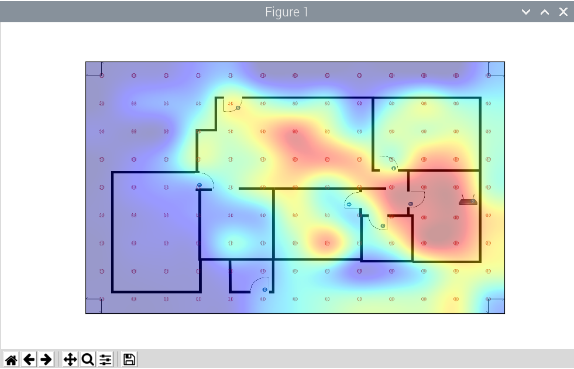
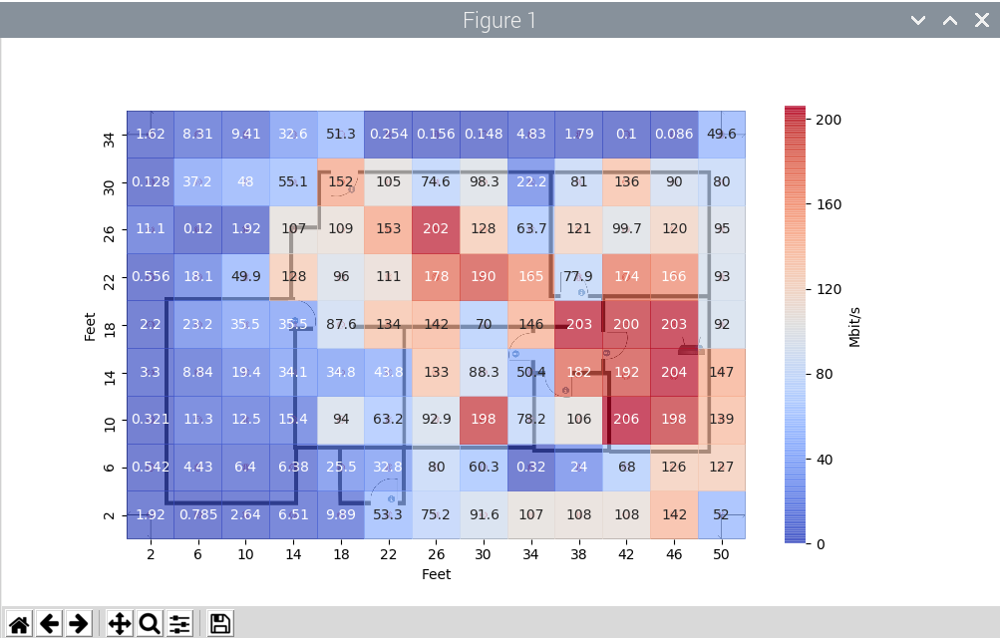
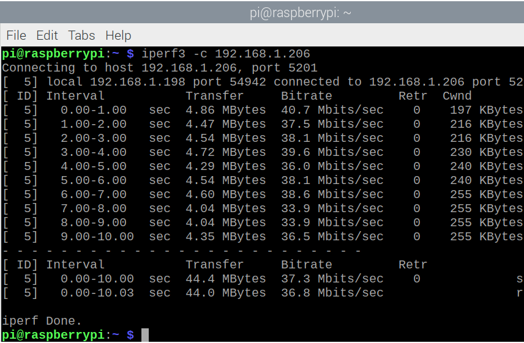
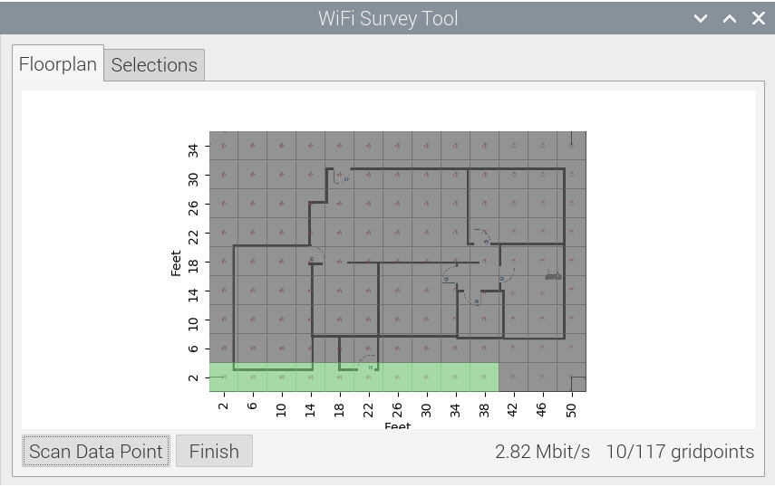

# Wireless Survey Heatmap

The goal of this application is to give a visual representation to a users home WiFi signal. The primary measurement is the bitrate of TCP packets from the wireless router to the measurement device.

## Requirements 

#### Linux tools:

* [iperf3][1] - Takes active bitrate measurements on networks.

#### Python libraries:

* [numpy][2] - used to setup/store the multi-dimensional data to be graphed 
* [pandas][3] - used to convert numpy data into dataframes for plot reading
* [matplotlib][4] - backbone for creating the graphs and visuals
* [seaborn][5] - built ontop of matplotlib for extensibility/features 
* [PyQt5][6] - Graphical UI wrapper for demonstration purposes

Extra:

* [smartdraw][7] - used to mockup floorplans
* [RaspberryPi][8] - single board computer, good for portability 

---

#### Current inputs upon start:

* The created floor plan for the space 
* The IP address of the iperf3 server on the network
* The matrix of gridpoints that are being used for floorplan

Example: The house demo consists of a 9x13 matrix of grid points, spaced
4 feet apart over a ~1700 Sqft area. 4-feet between grid points seemed like a 
happy middle ground between too-few and too-many measurements.
 

#### Currently working in three stages:

1. Gathering network readings 
2. Read network readings / update graph
3. Output final graphs

---
 
### 1. Gathering network readings

This resides in the **scan data point** function.

Iperf3 is used to gather bitrate readings on the network. An iperf server needs
to be setup on the network in order to talk with the client (the computer taking
the readings). So the server is running 'iperf3 -s' for server mode, and by
default listening on port 5201.

Being run on the client side: 
> 'iperf3 -c *server ip* -J > *outputfile*'
 
-c is for client mode, then passing the ip address of the listening iperf 
server on the network. -J is for outputing all the scanned data to a JSON
file for easy manipulation later.

By default and in the house demo, the iperf3 client hits the server with 10
TCP bitrate readings then averages the readings together. The data currently
being shown in the graph is actually the average of 10 readings per each grid
point.  

For each gridpoint:

---

### 2. Read network readings / update graph
 
This resides in the **scan data point** function.

JSON output [looks like this.](output/iperf_json)

The JSON file is being opened and the average bits/sec received is being pulled 
out. This is converted to average Mbits/sec and then stored in a list. 

To update the graph in real time (and also used to display the final graphs), 
a multi dimensional numpy array is created by using the known matrix of grid 
points combined with the list of current measurements. 

By default, both those data structures (the numpy array and the measurement list)
are initialized with all zeros. This is so when updating in real time,
measurements not already taken appear as zero.

Initialized numpy array [looks like this.](output/numpy_output)

A dataframe is then created from the numpy array to be read by matplotlib for graphing.

Dataframe from numpy array [looks like this.](output/dataframe_output)

Dataframe with pivot to ready for graph mapping [looks like this.](output/df_pivot_output)

With the data pivoted this way you can tell that this is starting to look like the 
underlying graphed data. So as data is scanned, the corresponding zeros turn into bitrate
numbers (intensity). While graphing, the y-axis is flipped for origin = (0,0) bottom left. 

Then the map is redrawn, with zeros for all unmeasured points and a 1 indicating already 
measured points. This allows for two colors while updating the graph. 
The current number of grid points scanned appears in the user interface as a fraction of 
total grid points.

As of right now, the program is assuming the user is scanning gridpoints from 
bottom-left to right. A slight limitation which can be alleviated by making the
graph interactable and allowing the user to click on data points to scan. I 
haven't researched this yet but for our purposes the program is still solid 
without this interface feature. 

---

### 3. Output final graphs 

Similar to redrawing the map, after all the designated gridpoints are scanned, 
the user can click finish and output the final map display.

Thinking possibly having multiple tabs that populated with different graphs.
First two that come to mind are the color block graph with displayed bitrate and
the interpolated heatmap that shows a bit more gradation.

[1]: <https://iperf.fr>
[2]: <https://numpy.org/doc/stable/user/whatisnumpy.html>
[3]: <https://en.wikipedia.org/wiki/Pandas_%28software%29>
[4]: <https://matplotlib.org/>
[5]: <https://seaborn.pydata.org/>
[6]: <https://www.tutorialspoint.com/pyqt5/pyqt5_quick_guide.htm>
[7]: <https://www.smartdraw.com/>
[8]: <https://www.raspberrypi.org/products/raspberry-pi-4-model-b/>
